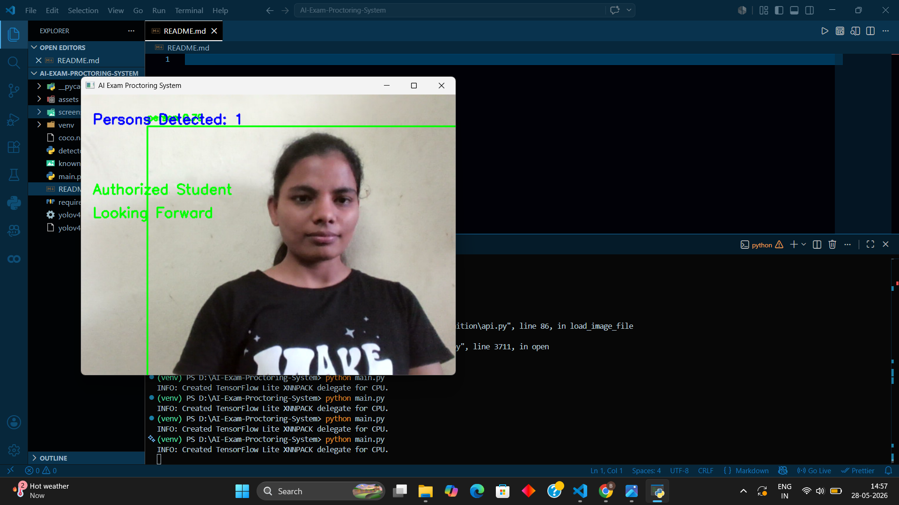
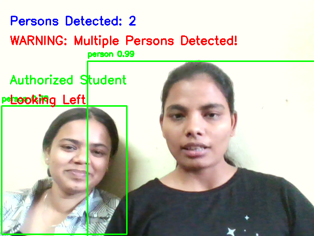
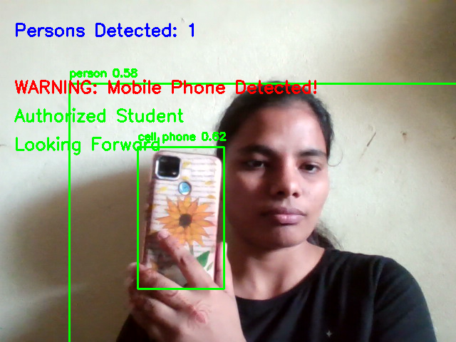

# AI Exam Proctoring System

An AI-based online exam monitoring system developed using Python, OpenCV, YOLO, MediaPipe, and Face Recognition.

This project monitors students during online examinations and detects suspicious activities such as:

* Multiple person detection
* Mobile phone detection
* Looking away detection
* Unauthorized person detection
* Screenshot capture during suspicious activity

---

# Features

✅ Real-time webcam monitoring
✅ Multiple person detection
✅ Mobile phone detection
✅ Looking away detection
✅ Face recognition authentication
✅ Screenshot capture on suspicious activity
✅ Real-time warning alerts
✅ AI-based monitoring system

---

# Technologies Used

* Python
* OpenCV
* YOLOv4-Tiny
* MediaPipe
* face_recognition
* NumPy

---

# Project Structure

```text
AI-Exam-Proctoring-System/
│
├── main.py
├── detector.py
├── requirements.txt
├── coco.names
├── yolov4-tiny.cfg
├── yolov4-tiny.weights
├── known_face.jpg
│
├── screenshots/
│
├── assets/
│   └── project_demo.mp4
│
└── README.md
```

---

# System Workflow

```text
Start Webcam
      ↓
Capture Video Frame
      ↓
YOLO Object Detection
      ↓
Check:
- Multiple Persons
- Mobile Phone
- Face Authentication
- Looking Direction
      ↓
Generate Warnings
      ↓
Capture Screenshot
      ↓
Continue Monitoring
```

---

# Installation

## Step 1 — Clone Repository

```bash
git clone https://github.com/Bhagyashree-Patil007/AI-Exam-Proctoring-System.git
```

---

## Step 2 — Open Project Folder

```bash
cd AI-Exam-Proctoring-System
```

---

## Step 3 — Create Virtual Environment

```bash
python -m venv venv
```

---

## Step 4 — Activate Virtual Environment

### Windows

```bash
venv\Scripts\activate
```

---

## Step 5 — Install Dependencies

```bash
pip install opencv-python mediapipe==0.10.9 numpy face_recognition
```

---

# Download YOLO Files

Download these files and place them inside the project folder:

* yolov4-tiny.cfg
* yolov4-tiny.weights
* coco.names

---

# Add Face Image

Add your clear face image:

```text
known_face.jpg
```

inside the project folder.

Requirements:

* Clear front face
* Single person only
* JPG format

---

# Run the Project

```bash
python main.py
```

---

# Output

The system displays:

* Person count
* Mobile phone detection
* Looking direction
* Authorized/Unauthorized user
* Warning alerts

Screenshots are automatically saved inside:

```text
screenshots/
```

when suspicious activity is detected.

---

# Screenshots

## Normal Monitoring



---

## Multiple Person Detection



---

## Mobile Phone Detection



---

# Future Improvements

* Eye tracking
* Voice detection
* Browser tab switching detection
* Cloud dashboard
* Exam report generation
* Database logging
* AI cheating score

---

# Skills Demonstrated

* Computer Vision
* Real-Time Video Processing
* Object Detection
* Face Recognition
* AI Monitoring System
* OpenCV Development
* YOLO Integration

---

# Applications

* Online Examination Systems
* AI Surveillance Systems
* Student Monitoring Systems
* Smart Classroom Monitoring

---

# Author

Bhagyashree Samadhan Patil

---

# License

This project is developed for educational and learning purposes.
